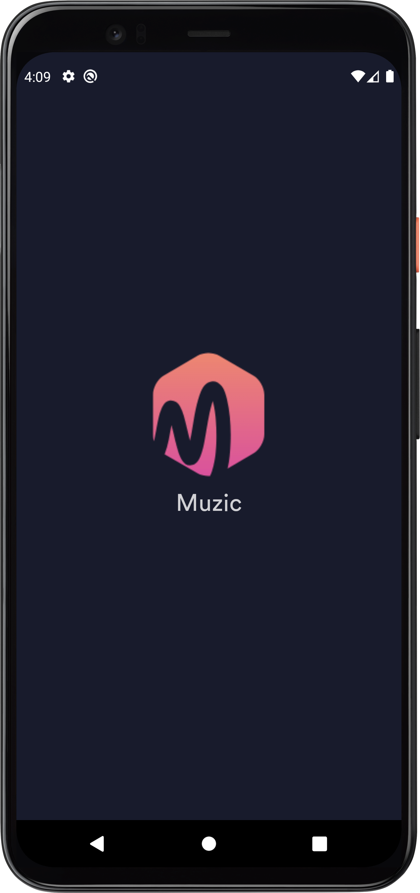
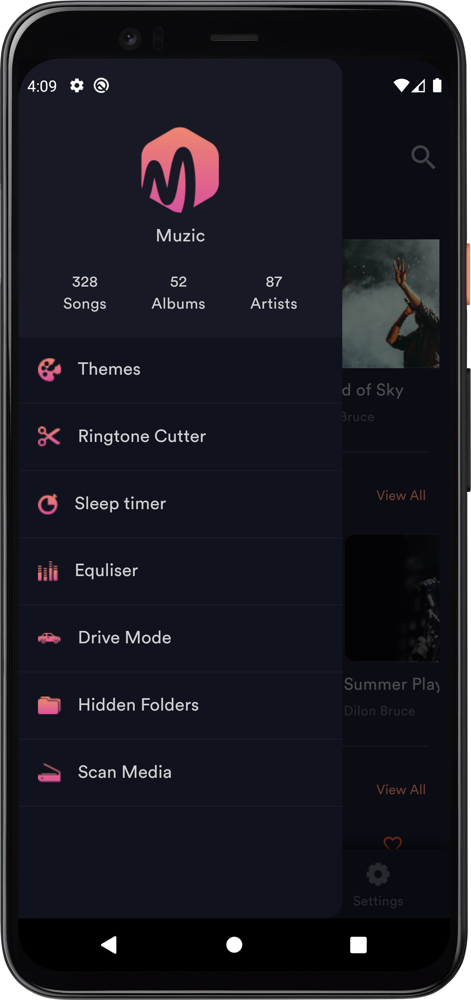
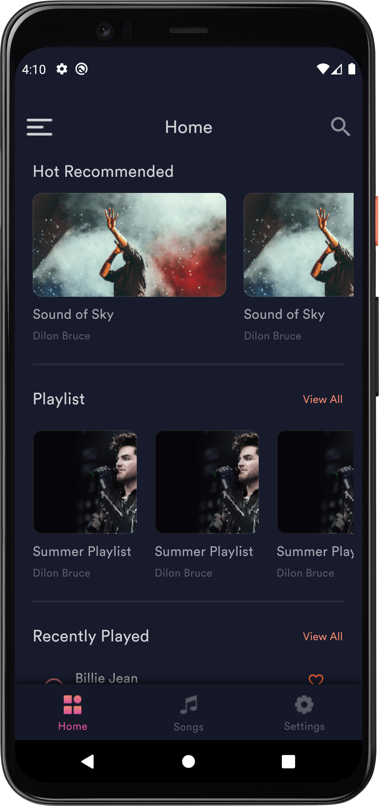
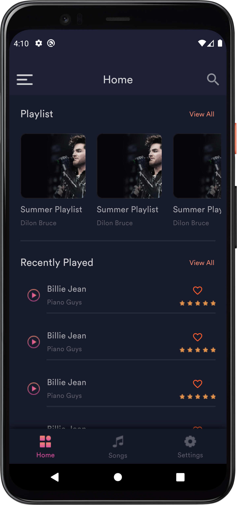
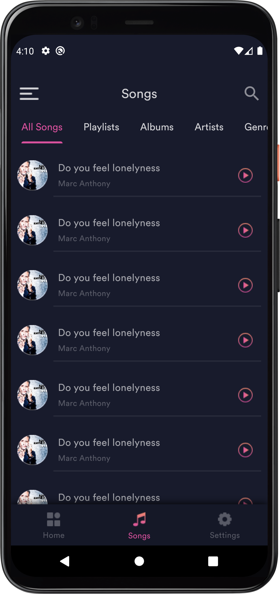
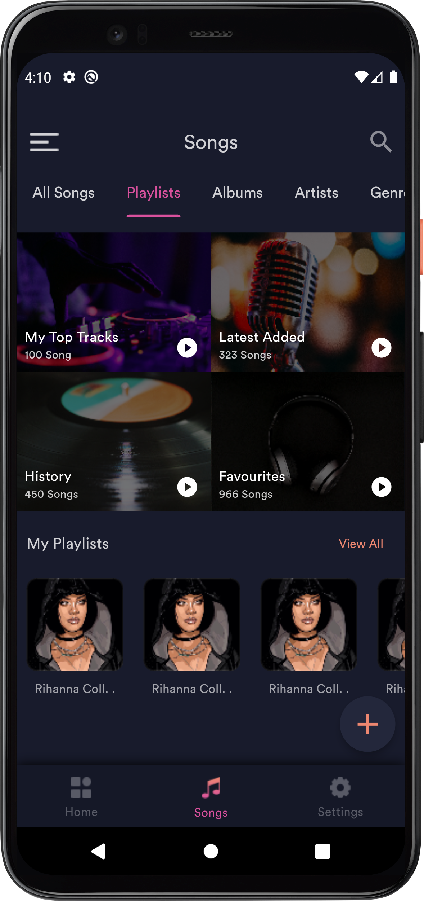
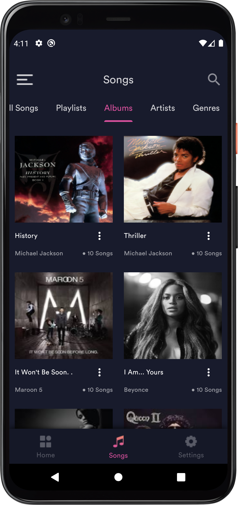
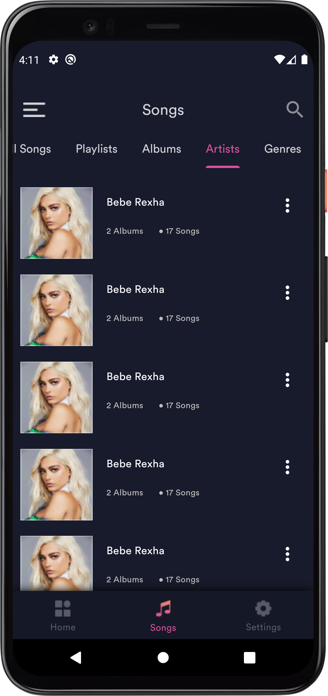
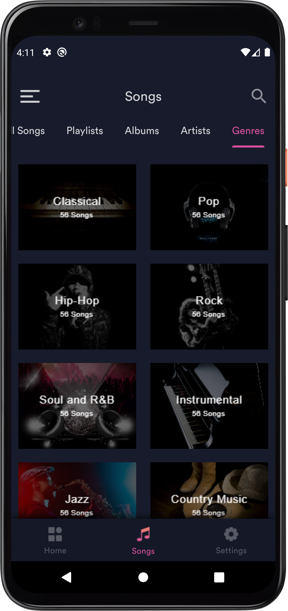
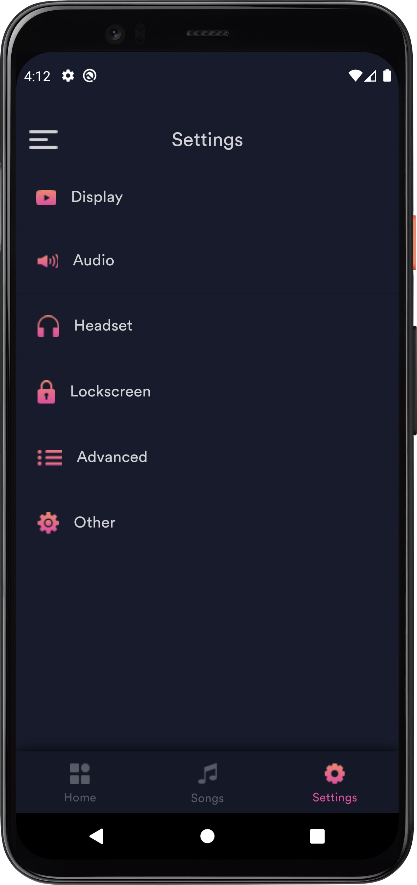

# Muzic App

## Description
The Muzic App is a mobile application built using Flutter that allows users to enjoy a seamless music experience. The app focuses on a clean UI and an engaging user experience.

## Features
1. Responsive UI: The app features a responsive design that adapts well to different screen sizes.

## Technologies Used
- Flutter
- Dart
- MVVM
- Cubit (for state management)

## Screenshots
               

## Contact
If you have any questions or feedback, please feel free to reach out to the project maintainers:
- Ahmed Mohsen : ahmedmohsen2492@gmail.com

